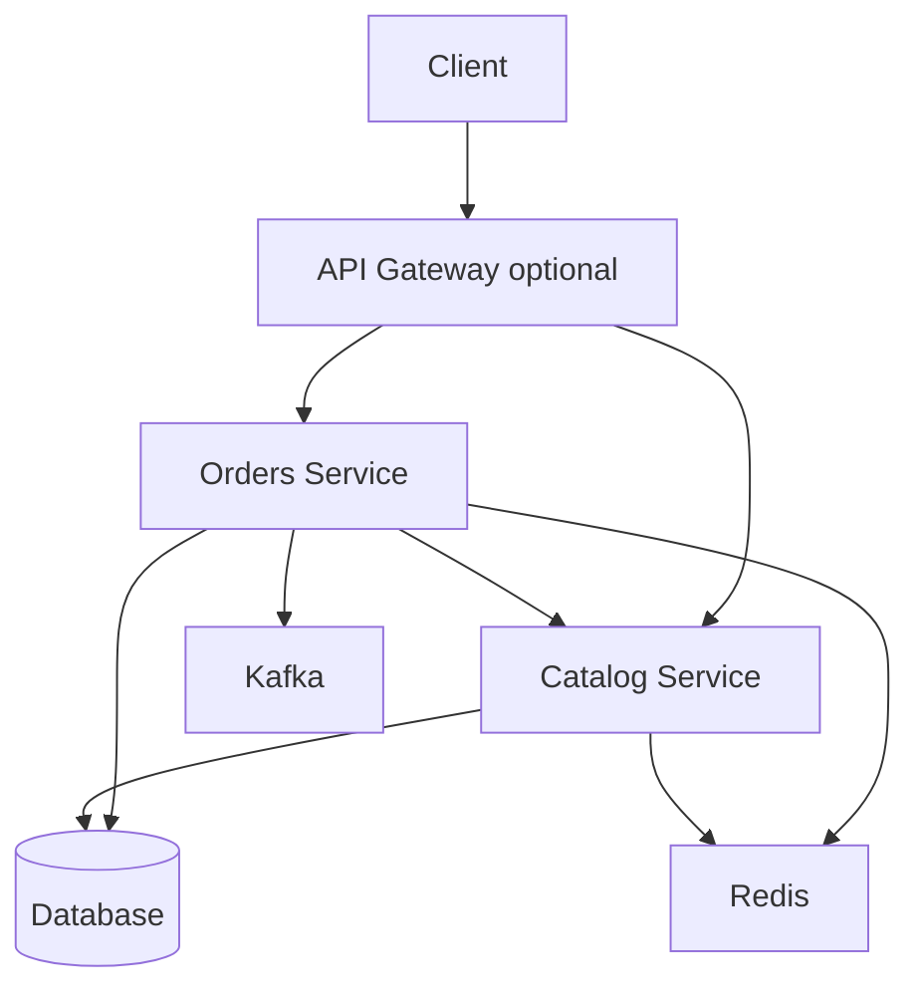
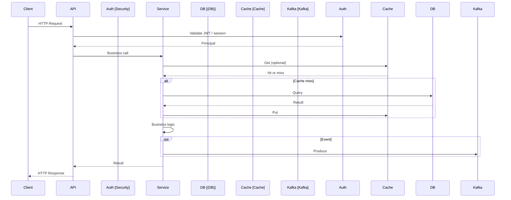

# Capstone — Architecture

## High-level system (ScaleCart)

- **Client** calls APIs (directly or via gateway). **Orders** and **Catalog** are the main services in the microservices layout (07).
- **Orders** uses RestClient to call Catalog (with circuit breaker), and may use DB, cache, and Kafka. **Catalog** serves products and uses DB and cache.
- In a monolithic variant, one app contains REST, JPA, Security, and Cache (and optionally Kafka producer/consumer).

---

## End-to-end request flow (API → auth → service → DB/cache/Kafka)

- **Request** hits API (controller). **Security** validates token and sets principal. **Service** runs business logic, may read/write **cache** and **DB**, and may **produce** to Kafka. Response is returned to the client.
- For **Orders → Catalog** call: Service uses RestClient (with circuit breaker); if Catalog is down, fallback or fast-fail is returned.

---

## Module map (conceptual)

| Concern | Primary modules |
|--------|------------------|
| Core (IoC, AOP, Boot) | 01 |
| REST, validation, errors | 02 |
| Persistence, transactions, locking | 03 |
| Auth, JWT, RBAC | 04 |
| Caching, async | 05 |
| Events, idempotency | 06 |
| Service communication, resilience, observability | 07 |
| Containers, K8s, CI/CD | 08 |

Use this map to navigate from a topic (e.g. “transactions”) to the right module and CONCEPTS.md.

---

## Capstone application layout

The **capstone-production-app** codebase is a single monolithic Spring Boot app that implements the above flow. Package layout:

| Package | Responsibility |
|---------|----------------|
| `config` | Cache (Redis / in-memory), Async (order confirmation executor), TraceId filter, Data initializer |
| `domain` | JPA entities: Product, Category, Order, OrderItem, User (with roles) |
| `dto` | Request/response DTOs and validation |
| `exception` | NotFoundException, ErrorDto, GlobalExceptionHandler |
| `repository` | Spring Data JPA repositories |
| `service` | ProductService, CategoryService, OrderService, OrderConfirmationService (@Async) |
| `web` | Controllers: Auth, Product, Category, Order; versioned under `/v1/` |
| `security` | JWT support, JwtAuthenticationFilter, UserDetailsService, SecurityConfig |
| `messaging` | OrderEventPublisher (Kafka / no-op), OrderEventConsumer (idempotent), OrderCreatedEvent |

REST is versioned (`/v1/products`, `/v1/categories`, `/v1/orders`). Public: GET products/categories and login. Protected: create/update/delete and orders; admin-only for product/category writes. Caching uses `@Cacheable` / `@CacheEvict` on products and categories; Redis when enabled, in-memory otherwise. Kafka is optional (dev profile excludes it so the app starts without a broker).